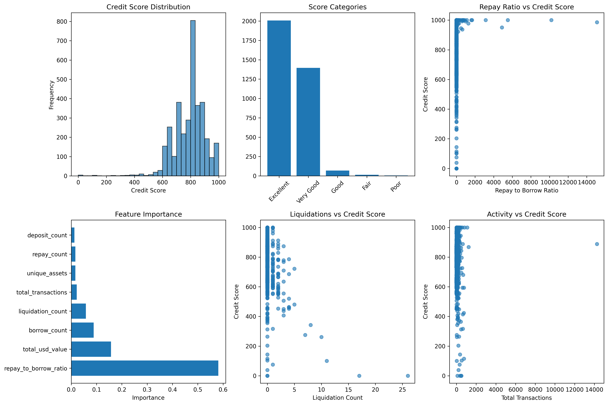

# 📊 Wallet Behavior Analysis

### Distribution Summary
- **Excellent (900–1000):** 57.4%
- **Very Good (800–900):** 39.9%
- **Poor–Good (0–800):** <3%

### Observations
- Wallets with **liquidations** had avg score: **642**
- Wallets with **low repay ratio (<0.5)**: **21.6%**
- Top wallets had zero liquidations and high repay consistency.

### Top Risk Flags
- High borrow frequency with low repay
- High liquidation rates
- Low diversity in assets or transactions

